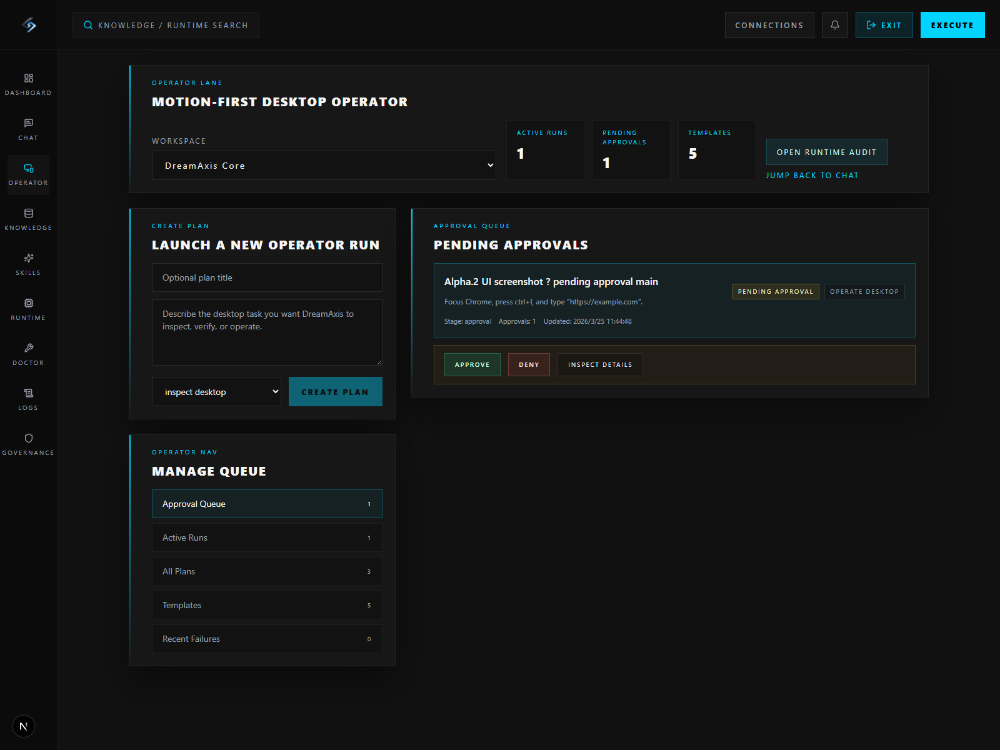
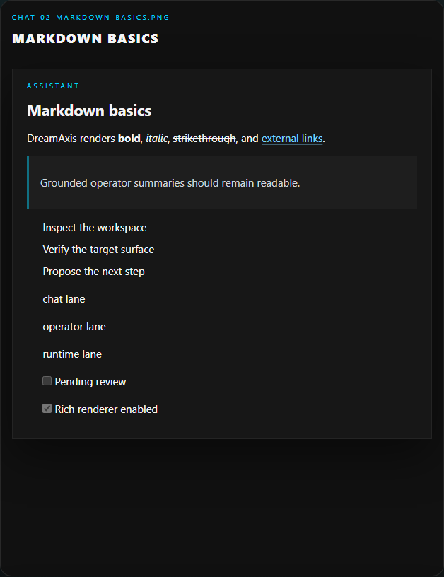
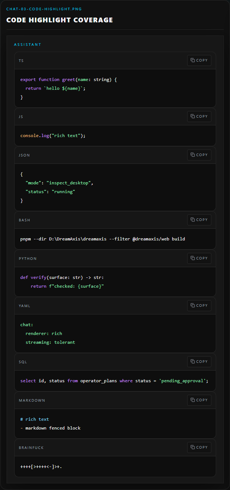
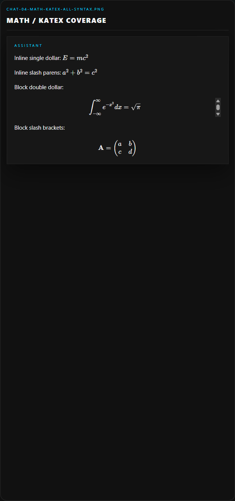
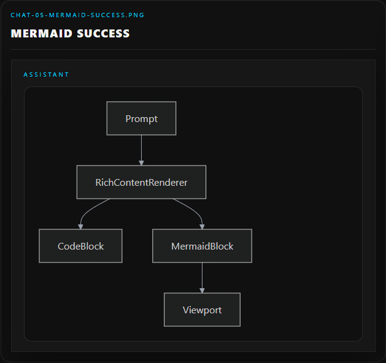
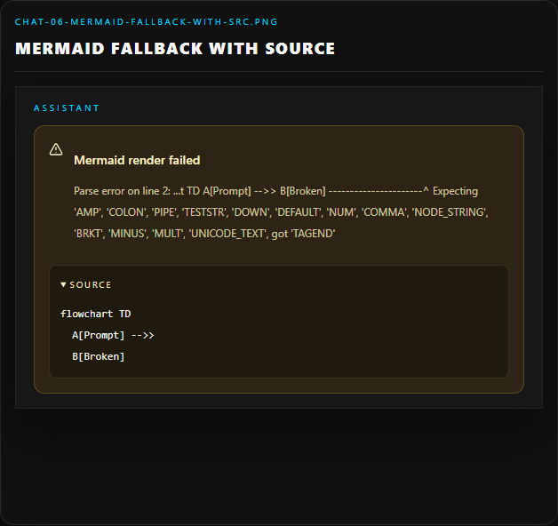
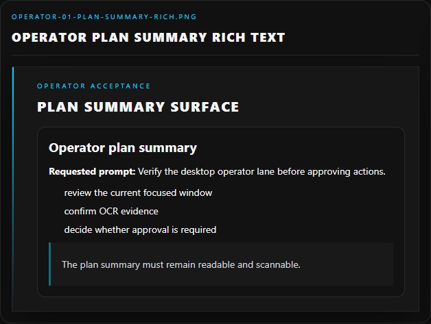

<p align="center">
  
</p>

<h1 align="center">DreamAxis</h1>

<p align="center">
  <strong>Local-first open-source operator workflow platform for self-hosted AI execution.</strong>
</p>

<p align="center">
  DreamAxis turns chat into a runtime-backed operator console for CLI, browser, and desktop work ¡ª with approval gates, audit trails, and rich final outputs instead of a hosted black box.
</p>

<p align="center">
  
  
  
  
  
  
</p>

## Why DreamAxis

DreamAxis is built for operators and builders who want:

- **no signup by default** with `AUTH_MODE=local_open`
- **self-hosted provider keys** instead of a central account dependency
- **OperatorPlan-backed execution** instead of disconnected one-off prompts
- **CLI + Browser + Desktop runtimes** for real execution, not chat alone
- **approval-gated desktop actions** with runtime-backed audit and resume support
- **proposal-only repo/code repair lanes** instead of silent file edits
- **rich final outputs** with Markdown, code highlighting, KaTeX, and Mermaid rendering
- a stronger local baseline aligned with modern desktop coding assistants:
  **Git + Node.js + pnpm/npm + Python**

## The core promise

DreamAxis is designed around five simple defaults:

- **local-first** - run on your own machine and infrastructure first
- **no-signup by default** - the main path starts with `AUTH_MODE=local_open`
- **operator-first** - multi-step work is routed through plans, approvals, and visible execution state
- **runtime-backed audit** - chat, operator, and runtime stay linked to the same evidence trail
- **self-hosted assets** - keep provider keys, skills, knowledge, and workspace data under your control

## Verified acceptance status

Latest local acceptance baseline:

- **v0.3.0-alpha.2 operator workflow:** `9/9` scenarios passed across inspect desktop, verify browser, operate with approval, triad summary, failure reflection narrowing, and repo non-regression lanes
- **rich text v1 rendering:** fixed-fixture acceptance captured in `13` tracked screenshots across chat, operator, runtime, Mermaid fallback, HTML escaping, and narrow viewport coverage
- **v0.2 chat-first repo copilot:** `8/8` scenarios passed
- **NVIDIA Build provider validation:** `9/9` scenarios passed
- **operator workflow core:** multi-step OperatorPlan execution, approval queue handling, bounded reflection, deterministic desktop grounding, and resume are now validated end to end
- **operator surfaces:** `/chat`, `/operator`, and `/runtime` now divide cleanly into live operation, approval management, and deep audit
- **rich output layer:** final assistant and operator summaries now support Markdown, tables, code highlighting, KaTeX, and Mermaid without changing the backend message model
- **Windows host desktop runtime:** inspect, verify, and approval-gated operate flows validated with real `focus_window`, `launch_app`, `press_hotkey`, `type_text`, and `click` actions
- validated across:
  - DreamAxis
  - a Node.js repo
  - a Python repo
- focused on:
  - visible operator state
  - approval-gated desktop action
  - proposal-only repair output
  - runtime-backed evidence and parent/child execution linkage
  - rich final-message rendering

See:

- [docs/acceptance-report-alpha2.md](./docs/acceptance-report-alpha2.md)
- [docs/acceptance/rich-text-v1/acceptance-report.md](./docs/acceptance/rich-text-v1/acceptance-report.md)
- [docs/chat-acceptance-report-v0.2.md](./docs/chat-acceptance-report-v0.2.md)
- [docs/chat-acceptance-report-nvidia.md](./docs/chat-acceptance-report-nvidia.md)
- [docs/repo-copilot-runbook.md](./docs/repo-copilot-runbook.md)
- [docs/desktop-host-validation-2026-03-24.md](./docs/desktop-host-validation-2026-03-24.md)

## Screenshots

### Dashboard


*Operational overview for providers, runtimes, skills, knowledge, and workspace activity.*

### Product surfaces

| Skills | Operator | Runtime |
|---|---|---|
|  |  |  |
| Skill packs, execution entrypoints, and capability-aware actions. | Approval queue, active runs, templates, and plan-level controls for OperatorPlan-managed execution. | Runtime hosts, operator lineage, verification summaries, artifact-first audit, and child execution trails back to chat turns. |

| Knowledge | Chat |
|---|---|
|  |  |
| Builtin packs, uploaded documents, and retrieval-ready assets. | Operator-first chat console with active-step emphasis, approval prominence, runtime evidence, and rich final-message rendering for Markdown, code, math, and Mermaid. |

See [docs/screenshots.md](./docs/screenshots.md) for the canonical screenshot index and refresh rules.

### Rich Text v1 acceptance samples

| Chat rendering | Code highlight | Math + KaTeX |
|---|---|---|
|  |  |  |
| Final assistant messages now support Markdown, links, lists, tables, and safe rich formatting. | Fenced blocks render with language labels, copy actions, and readable syntax highlighting. | Inline and block math render through KaTeX, including the fixture coverage used in acceptance. |

| Mermaid success | Mermaid fallback | Operator + Runtime rich text |
|---|---|---|
|  |  |  |
| Mermaid fenced blocks render client-side without changing the message model. | Failed Mermaid diagrams degrade locally with an error card and visible source block. | The same renderer now powers operator and runtime explanatory summaries while raw logs stay monospace. |

## What you can do with it

DreamAxis now presents a clear alpha.2 shape:

- `/chat` = the live operator console
- `/operator` = approvals, queues, templates, and plan management
- `/runtime` = audit, lineage, artifacts, and execution detail

### Run locally

- bootstrap directly into the app with `local_open`
- use Docker for the full stack or run services separately
- validate machine and workspace readiness from `/environment`

### Bring your own model gateway

- configure your own OpenAI-compatible base URL and API key
- sync available models or enter a model manually
- keep provider secrets self-hosted in your own deployment

### Execute via CLI + Browser + Desktop

- run CLI skills against your local workspace
- run Playwright-backed browser skills and capture artifacts
- inspect the Windows desktop surface through the host desktop runtime
- execute approval-gated desktop actions with runtime-backed audit trails
- manage OperatorPlan approvals and active runs from `/operator`
- follow active-step state in `/chat` and deep lineage in `/runtime`
- review runtime hosts, sessions, executions, and outputs in one place
- render final assistant and operator summaries with safe rich text instead of raw plain-text dumps
- use chat-first verify / troubleshoot flows with grounded targets, reflection-aware follow-up, and runtime-backed failure summaries instead of black-box answers

## What makes it different

### Local-first by default

- default mode is `AUTH_MODE=local_open`
- no public registration flow is required for a local install
- metadata stays in **your PostgreSQL**
- uploaded knowledge files stay on **your disk**
- provider API keys stay **self-hosted**

### Real execution layer

DreamAxis already includes:

- **CLI Runtime v1**
- **Browser Runtime v1 (Playwright)**
- **Desktop Runtime v1 (Windows host worker)**
- **OperatorPlan alpha.2 workflow layer** with inspect / verify / operate / proposal sequencing
- runtime/session/execution visibility in the web console
- chat-first troubleshooting summaries and approval-gated desktop actions backed by runtime evidence, not prose-only diagnosis
- rich final-message rendering that upgrades explanatory output without changing the execution backend

### Reusable system assets

- **Builtin skill packs:** `core-cli`, `core-browser-playwright`, `core-research`, `core-docs`, `core-knowledge`, `core-repo`
- **Builtin knowledge packs:** Playwright, Git, Docker, Python, TypeScript, FastAPI, Next.js, DreamAxis architecture
- **OpenAI-compatible provider connections:** user-supplied key, configurable base URL, dynamic model selection

### Desktop AI Assistant Standard v1

DreamAxis treats the local environment as a product surface, not a hidden prerequisite:

- **required:** Git, Node.js, pnpm/npm, Python
- **optional:** Docker, Browser Runtime, Playwright
- **Doctor page:** checks readiness before a skill fails

See [docs/environment-standard.md](./docs/environment-standard.md) and [docs/doctor.md](./docs/doctor.md).

## Quick start

### 1. Install the baseline

Recommended local baseline:

- Git
- Node.js 22+
- pnpm 10+ or npm
- Python 3.12+
- Docker Desktop (recommended)

### 2. Clone and install

```powershell
git clone https://github.com/DREAMVFIAUNION/dreamaxis.git
cd dreamaxis
pnpm install
```

### 3. Create `.env`

```powershell
Copy-Item .env.example .env
```

Recommended minimum:

```env
AUTH_MODE=local_open
ENABLE_BROWSER_RUNTIME=true
JWT_SECRET_KEY=change-me-dreamaxis-development-secret
APP_ENCRYPTION_KEY=change-me-with-a-long-random-secret
```

### 4. Start the stack

```powershell
docker compose -f infrastructure/docker/docker-compose.yml up --build
```

### 5. Open the app

- Web: [http://localhost:3000](http://localhost:3000)
- API health: [http://localhost:8000/health](http://localhost:8000/health)

For the full development setup, non-Docker workflow, and reset instructions, see [docs/development.md](./docs/development.md).

## First-run flow

1. Enter directly with `local_open`
2. Open `/settings/providers`
3. Add an OpenAI-compatible API key
4. Sync models or enter one manually
5. Open `/environment` and confirm baseline readiness
6. Run one CLI skill
7. Run one Browser skill
8. Sync builtin knowledge packs
9. Upload a document
10. Open `/chat/local-demo` and send a knowledge-enabled message
11. Inspect `/runtime` for the execution trail

## Where your data lives

- user / workspace / provider / runtime / skill / knowledge metadata -> PostgreSQL
- provider API keys -> encrypted in `provider_connections`
- uploaded documents -> `KNOWLEDGE_STORAGE_PATH`
- browser auth token -> local browser storage

DreamAxis does **not** require a hosted account system for the default path.

## Core routes

- `/dashboard`
- `/chat/[conversationId]` - live operator console with approval-aware execution state and rich final outputs
- `/operator` - approval queue, active runs, templates, and plan management
- `/skills`
- `/knowledge`
- `/runtime` - audit plane with lineage, artifacts, raw logs, and execution detail
- `/environment`
- `/settings/providers`
- `/acceptance/rich-text-v1` - fixed-fixture rendering acceptance harness
- `/login` (only for optional `password` mode)

## Read the docs

- [docs/architecture.md](./docs/architecture.md)
- [docs/development.md](./docs/development.md)
- [docs/deployment-modes.md](./docs/deployment-modes.md)
- [docs/browser-runtime.md](./docs/browser-runtime.md)
- [docs/acceptance-report-alpha2.md](./docs/acceptance-report-alpha2.md)
- [docs/desktop-runtime-v1.md](./docs/desktop-runtime-v1.md)
- [docs/acceptance/rich-text-v1/acceptance-report.md](./docs/acceptance/rich-text-v1/acceptance-report.md)
- [docs/skill-packs.md](./docs/skill-packs.md)
- [docs/knowledge-packs.md](./docs/knowledge-packs.md)
- [docs/backend-api.md](./docs/backend-api.md)
- [docs/skill-requirements.md](./docs/skill-requirements.md)
- [docs/launch/README.md](./docs/launch/README.md)
- [docs/launch/csdn-build-log-tutorial.md](./docs/launch/csdn-build-log-tutorial.md)
- [docs/v0.3-desktop-operator-plan.md](./docs/v0.3-desktop-operator-plan.md)
- [ROADMAP.md](./ROADMAP.md)
- [CHANGELOG.md](./CHANGELOG.md)

## Community

- [CONTRIBUTING.md](./CONTRIBUTING.md)
- [CODE_OF_CONDUCT.md](./CODE_OF_CONDUCT.md)
- [SECURITY.md](./SECURITY.md)
- [SUPPORT.md](./SUPPORT.md)

## License

DreamAxis is released under the [MIT License](./LICENSE).


