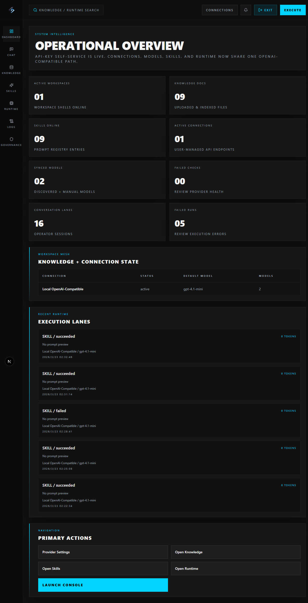
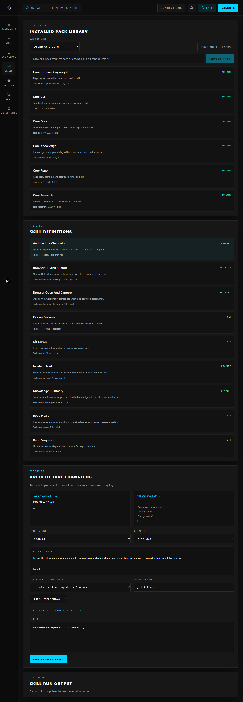
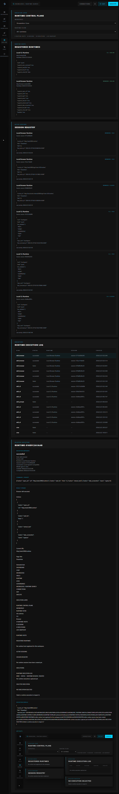
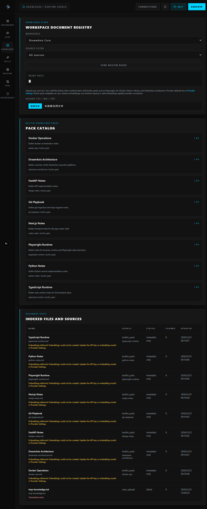
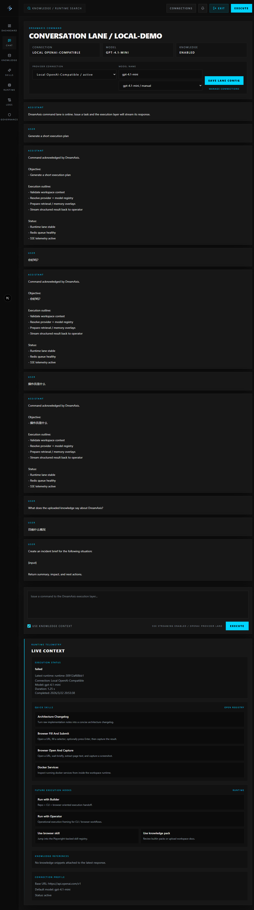

# DreamAxis

<p align="center">
  
</p>

<h1 align="center">DreamAxis</h1>

<p align="center">
  <strong>Local-first open-source agent execution platform for self-hosted AI workflows.</strong>
</p>

<p align="center">
  DreamAxis turns models, runtimes, skills, and knowledge into reusable local assets instead of a hosted black box.
</p>

<p align="center">
  
  
  
  
  
  
</p>

## Why DreamAxis

DreamAxis is built for operators and builders who want:

- **no signup by default** with `AUTH_MODE=local_open`
- **self-hosted provider keys** instead of a central account dependency
- **CLI + Browser runtimes** for real execution, not chat alone
- **skill packs** that can be reused, imported, and expanded
- **knowledge packs + uploads** that compound into durable project memory
- a stronger local baseline aligned with modern desktop coding assistants:
  **Git + Node.js + pnpm/npm + Python**

## Screenshots

### Dashboard



*Operational overview for providers, runtimes, skills, knowledge, and workspace activity.*

### Product surfaces

| Skills | Runtime |
|---|---|
|  |  |
| Skill packs, execution entrypoints, and capability-aware actions. | Runtime hosts, sessions, executions, and artifacts. |

| Knowledge | Chat |
|---|---|
|  |  |
| Builtin packs, uploaded documents, and retrieval-ready assets. | Streaming conversations backed by providers, runtime history, and knowledge context. |

See [docs/screenshots.md](./docs/screenshots.md) for the canonical screenshot index and refresh rules.

## What makes it different

### Local-first by default

- default mode is `AUTH_MODE=local_open`
- no public registration flow is required for a local install
- metadata stays in **your PostgreSQL**
- uploaded knowledge files stay on **your disk**
- provider API keys stay **self-hosted**

### Real execution layer

DreamAxis already includes:

- **CLI Runtime v1**
- **Browser Runtime v1 (Playwright)**
- runtime/session/execution visibility in the web console

### Reusable system assets

- **Builtin skill packs:** `core-cli`, `core-browser-playwright`, `core-research`, `core-docs`, `core-knowledge`, `core-repo`
- **Builtin knowledge packs:** Playwright, Git, Docker, Python, TypeScript, FastAPI, Next.js, DreamAxis architecture
- **OpenAI-compatible provider connections:** user-supplied key, configurable base URL, dynamic model selection

### Desktop AI Assistant Standard v1

DreamAxis treats the local environment as a product surface, not a hidden prerequisite:

- **required:** Git, Node.js, pnpm/npm, Python
- **optional:** Docker, Browser Runtime, Playwright
- **Doctor page:** checks readiness before a skill fails

See [docs/environment-standard.md](./docs/environment-standard.md) and [docs/doctor.md](./docs/doctor.md).

## Quick start

### 1. Install the baseline

Recommended local baseline:

- Git
- Node.js 22+
- pnpm 10+ or npm
- Python 3.12+
- Docker Desktop (recommended)

### 2. Clone and install

```powershell
git clone https://github.com/DREAMVFIAUNION/dreamaxis.git
cd dreamaxis
pnpm install
```

### 3. Create `.env`

```powershell
Copy-Item .env.example .env
```

Recommended minimum:

```env
AUTH_MODE=local_open
ENABLE_BROWSER_RUNTIME=true
JWT_SECRET_KEY=change-me-dreamaxis-development-secret
APP_ENCRYPTION_KEY=change-me-with-a-long-random-secret
```

### 4. Start the stack

```powershell
docker compose -f infrastructure/docker/docker-compose.yml up --build
```

### 5. Open the app

- Web: [http://localhost:3000](http://localhost:3000)
- API health: [http://localhost:8000/health](http://localhost:8000/health)

## First-run flow

1. Enter directly with `local_open`
2. Open `/settings/providers`
3. Add an OpenAI-compatible API key
4. Sync models or enter one manually
5. Open `/environment` and confirm baseline readiness
6. Run one CLI skill
7. Run one Browser skill
8. Sync builtin knowledge packs
9. Upload a document
10. Open `/chat/local-demo` and send a knowledge-enabled message
11. Inspect `/runtime` for the execution trail

## Where your data lives

- user / workspace / provider / runtime / skill / knowledge metadata -> PostgreSQL
- provider API keys -> encrypted in `provider_connections`
- uploaded documents -> `KNOWLEDGE_STORAGE_PATH`
- browser auth token -> local browser storage

DreamAxis does **not** require a hosted account system for the default path.

## Core routes

- `/dashboard`
- `/chat/[conversationId]`
- `/skills`
- `/knowledge`
- `/runtime`
- `/environment`
- `/settings/providers`
- `/login` (only for optional `password` mode)

## Read the docs

- [docs/architecture.md](./docs/architecture.md)
- [docs/development.md](./docs/development.md)
- [docs/deployment-modes.md](./docs/deployment-modes.md)
- [docs/browser-runtime.md](./docs/browser-runtime.md)
- [docs/skill-packs.md](./docs/skill-packs.md)
- [docs/knowledge-packs.md](./docs/knowledge-packs.md)
- [docs/backend-api.md](./docs/backend-api.md)
- [docs/skill-requirements.md](./docs/skill-requirements.md)
- [ROADMAP.md](./ROADMAP.md)
- [CHANGELOG.md](./CHANGELOG.md)

## Community

- [CONTRIBUTING.md](./CONTRIBUTING.md)
- [CODE_OF_CONDUCT.md](./CODE_OF_CONDUCT.md)
- [SECURITY.md](./SECURITY.md)
- [SUPPORT.md](./SUPPORT.md)

## License

DreamAxis is released under the [MIT License](./LICENSE).
