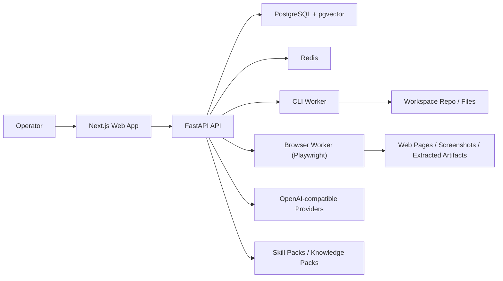

# DreamAxis


DreamAxis is a **local-first, open-source agent execution platform** for self-hosted AI workflows.

It is built around five defaults:

- **no signup by default**
- **self-hosted provider keys**
- **CLI + Browser runtimes**
- **syncable skill packs**
- **durable knowledge assets**

It now also ships with a formal **Desktop AI Assistant Standard v1**:

- **required baseline**: Git + Node.js + pnpm/npm + Python
- **optional execution layer**: Docker + Browser Runtime + Playwright
- **doctor surface**: the app can explain what is missing before a skill fails

DreamAxis is not trying to be a closed SaaS clone. The goal is a more open foundation for runtime execution, knowledge accumulation, and future agent-role orchestration.

## Why DreamAxis

DreamAxis is for people who want:

- a **self-hosted** AI control plane instead of a hosted black box
- **OpenAI-compatible model access** without hard-locking the product to one vendor
- a place where **skills, runtimes, and knowledge** become reusable assets
- a practical path from **chat UI** to **real execution**
- a future-ready base for **agent roles and orchestration**

## Screenshots

| Dashboard | Runtime |
|---|---|
|  |  |

| Skills | Knowledge |
|---|---|
|  |  |

See [docs/screenshots.md](./docs/screenshots.md) for the full screenshot index.

## Architecture at a glance



See [docs/architecture.md](./docs/architecture.md) for the fuller breakdown.

## Quick links

- [Quick start](#quick-start)
- [Desktop AI Assistant Standard](#desktop-ai-assistant-standard)
- [No-signup by default](#no-signup-by-default)
- [Where data is stored](#where-data-is-stored)
- [Core feature set](#core-feature-set)
- [First-run validation path](#first-run-validation-path)
- [Reset local demo state](#reset-local-demo-state)
- [Additional docs](#additional-docs)
- [Community](#community)

## No-signup by default

By default, DreamAxis runs in:

```env
AUTH_MODE=local_open
```

In this mode:

- there is **no public registration flow**
- the app auto-bootstraps a local operator session
- your metadata stays in **your own PostgreSQL**
- your provider API keys stay in **your own database**
- your knowledge files stay on **your own disk**

If you want a login gate for a shared deployment, set:

```env
AUTH_MODE=password
```

See [docs/deployment-modes.md](./docs/deployment-modes.md).

## Where data is stored

For self-hosted/open-source deployments:

- user / workspace / provider / runtime / skill / knowledge metadata -> PostgreSQL
- provider API keys -> encrypted in `provider_connections`
- uploaded documents -> `KNOWLEDGE_STORAGE_PATH`
- browser auth token -> localStorage in the browser

DreamAxis does **not** require a central hosted account system for the default experience.

## Current stack

- **Web:** Next.js 15, React 19, TypeScript, Tailwind
- **API:** FastAPI, SQLAlchemy, Alembic
- **Data:** PostgreSQL + pgvector, Redis
- **Runtime:** Python worker services for CLI and Browser execution
- **AI:** OpenAI-compatible provider connections
- **Infra:** Docker Compose

## Desktop AI Assistant Standard

DreamAxis follows the same practical local prerequisites that modern desktop coding assistants expect:

- **Git**
- **Node.js**
- **pnpm or npm**
- **Python**

Optional but recommended:

- **Docker Desktop**
- **Browser Runtime / Playwright**

Why this matters:

- CLI, repo, and docs skills depend on a real local developer environment
- Browser skills depend on an available Playwright runtime
- DreamAxis now exposes a dedicated **Doctor** page at `/environment` to show missing tools, workspace readiness, and install guidance

See:

- [docs/environment-standard.md](./docs/environment-standard.md)
- [docs/doctor.md](./docs/doctor.md)
- [docs/skill-requirements.md](./docs/skill-requirements.md)

## Monorepo structure

- `apps/web` - operator UI
- `apps/api` - FastAPI API + migrations
- `apps/worker` - CLI runtime host
- `apps/browser-worker` - Playwright browser runtime host
- `packages/client` - shared TS API client/types
- `packages/ui` - shared UI tokens/layout constants
- `infrastructure/docker` - Docker Compose stack
- `docs` - architecture and operator docs

## Core feature set

### 1. Local-open auth

- `local_open` is the default deployment mode
- optional `password` mode remains available
- `GET /api/v1/app-config`
- `POST /api/v1/auth/bootstrap`

### 2. OpenAI-compatible provider connections

Users can configure their own:

- base URL
- API key
- default chat model
- default embedding model

DreamAxis handles:

- encrypted key storage
- connection tests
- model sync where `/models` is available
- manual model entry when discovery is unavailable

### 3. Skill packs

Builtin packs ship with the repo, and local/community packs can be imported.

Current builtin packs:

- `core-cli`
- `core-browser-playwright`
- `core-research`
- `core-docs`
- `core-knowledge`
- `core-repo`

See [docs/skill-packs.md](./docs/skill-packs.md).

### 4. Knowledge packs

Builtin docs seed the instance with reusable operational knowledge.

Current builtin packs:

- Playwright
- Git
- Docker
- Python
- TypeScript
- FastAPI
- Next.js
- DreamAxis architecture

See [docs/knowledge-packs.md](./docs/knowledge-packs.md).

### 5. Runtime layer

DreamAxis currently supports:

- **CLI Runtime v1**
- **Browser Runtime v1 (Playwright)**

See [docs/browser-runtime.md](./docs/browser-runtime.md).

## Quick start

### 1. Install dependencies

DreamAxis Desktop Standard v1 baseline:

- Git
- Node.js 22+
- pnpm 10+ or npm
- Python 3.12+
- Docker Desktop (optional but recommended)

```powershell
cd D:/DreamAxis/dreamaxis
pnpm install
```

### 2. Create `.env`

```powershell
Copy-Item D:/DreamAxis/dreamaxis/.env.example D:/DreamAxis/dreamaxis/.env
```

Recommended defaults:

```env
AUTH_MODE=local_open
ENABLE_BROWSER_RUNTIME=true
JWT_SECRET_KEY=change-me-dreamaxis-development-secret
APP_ENCRYPTION_KEY=change-me-with-a-long-random-secret
```

Optional development fallback connection:

```env
OPENAI_API_KEY=
OPENAI_BASE_URL=
OPENAI_CHAT_MODEL=gpt-4.1-mini
OPENAI_EMBEDDING_MODEL=text-embedding-3-small
```

`OPENAI_*` is a development fallback only. The intended product flow is configuring keys from the UI.

### 3. Start the stack

```powershell
docker compose -f D:/DreamAxis/dreamaxis/infrastructure/docker/docker-compose.yml up --build
```

If you are upgrading an existing local database from an older DreamAxis build, run:

```powershell
cd D:/DreamAxis/dreamaxis/apps/api
alembic upgrade head
```

or reset the local demo stack to a clean state.

### 4. Open the app

- Web: [http://localhost:3000](http://localhost:3000)
- API health: [http://localhost:8000/health](http://localhost:8000/health)

With `AUTH_MODE=local_open`, you should enter the app **without a required login step**.

## First-run validation path

Use this exact sequence after startup:

1. open the app
2. enter directly via `local_open`
3. go to `/settings/providers`
4. add an OpenAI-compatible API key
5. sync models or enter one manually
6. open `/skills`
7. open `/environment` and verify baseline readiness
8. run a CLI skill
9. run a Browser skill
10. open `/knowledge`
11. sync builtin knowledge packs
12. upload a txt/md/pdf file
13. open `/chat/local-demo`
14. send a knowledge-enabled message
15. open `/runtime` and inspect CLI + Browser + prompt execution history

## Knowledge indexing note

Builtin knowledge packs can sync even when no valid embedding key is configured.

That means:

- pack metadata and source documents still appear in `/knowledge`
- retrieval-ready embeddings are only created when a valid embedding-capable provider connection is configured
- if indexing is deferred, the UI should show a safe message instead of exposing raw provider errors

## Recommended smoke-test setup

DreamAxis is gateway-oriented rather than vendor-locked.

For smoke tests, use any **OpenAI-compatible** provider that offers:

- one chat model
- one embedding model if you want Knowledge / RAG

DreamAxis only needs the endpoint to support:

- chat completions
- streaming
- embeddings for knowledge indexing

## Reset local demo state

If you want to clear local chat/runtime noise and uploaded demo files while keeping the seeded DreamAxis experience:

```powershell
cd D:/DreamAxis/dreamaxis
./scripts/reset-local-demo.ps1 -Yes
```

Preview the reset first:

```powershell
cd D:/DreamAxis/dreamaxis
python scripts/reset-local-demo.py --dry-run
```

Default behavior:

- clears conversations, messages, runtime sessions, runtime executions
- removes uploaded knowledge documents and their local files
- removes non-builtin/imported packs from the demo workspace
- preserves runtime hosts and provider connections unless you opt in to resetting them
- re-seeds the local owner, workspace, conversation, builtin skill packs, and builtin knowledge packs

## Web routes

- `/` - landing
- `/dashboard` - control-center overview
- `/chat/[conversationId]` - streaming conversation lane
- `/knowledge` - documents + packs
- `/skills` - pack registry + execution
- `/runtime` - runtime hosts, sessions, executions, artifacts
- `/settings/providers` - provider connection management
- `/login` - optional password-mode entrypoint

## API highlights

- `GET /health`
- `GET /api/v1/app-config`
- `POST /api/v1/auth/bootstrap`
- `POST /api/v1/auth/login`
- `GET /api/v1/provider-connections`
- `GET /api/v1/skill-packs`
- `POST /api/v1/skill-packs/sync`
- `POST /api/v1/skill-packs/import`
- `GET /api/v1/knowledge-packs`
- `POST /api/v1/knowledge-packs/sync`
- `GET /api/v1/runtimes`
- `GET /api/v1/runtime-sessions`
- `GET /api/v1/runtime-executions`
- `POST /api/v1/runtime-executions/{id}/dispatch-browser`
- `POST /api/v1/skills/{id}/run`

## Local development without Docker

### API

```powershell
cd D:/DreamAxis/dreamaxis/apps/api
python -m pip install -e .
alembic upgrade head
uvicorn app.main:app --reload --host 0.0.0.0 --port 8000
```

### CLI worker

```powershell
cd D:/DreamAxis/dreamaxis/apps/worker
python -m pip install -e .
uvicorn app.main:app --reload --host 0.0.0.0 --port 8100
```

### Browser worker

```powershell
cd D:/DreamAxis/dreamaxis/apps/browser-worker
python -m pip install -e .
playwright install chromium
uvicorn app.main:app --reload --host 0.0.0.0 --port 8200
```

### Web

```powershell
cd D:/DreamAxis/dreamaxis
pnpm --filter @dreamaxis/web dev
```

## Validation commands

### Python compile

```powershell
cd D:/DreamAxis/dreamaxis
python -m compileall apps/api/app apps/worker/app apps/browser-worker/app
```

### Web production build

```powershell
cd D:/DreamAxis/dreamaxis
pnpm --filter @dreamaxis/web build
```

## Current boundaries

DreamAxis intentionally does **not** yet include:

- public signup / email verification / OAuth
- hosted cloud marketplace dependencies
- full multi-agent DAG orchestration
- advanced RBAC / tenant isolation
- native Anthropic / Gemini protocol adapters
- persistent artifact object storage outside MVP execution records

## Additional docs

- [docs/architecture.md](./docs/architecture.md)
- [docs/backend-api.md](./docs/backend-api.md)
- [docs/development.md](./docs/development.md)
- [docs/deployment-modes.md](./docs/deployment-modes.md)
- [docs/skill-packs.md](./docs/skill-packs.md)
- [docs/knowledge-packs.md](./docs/knowledge-packs.md)
- [docs/browser-runtime.md](./docs/browser-runtime.md)
- [docs/release-checklist.md](./docs/release-checklist.md)
- [docs/github-release-template.md](./docs/github-release-template.md)
- [docs/github-release-v0.1.0.md](./docs/github-release-v0.1.0.md)
- [docs/github-repo-metadata.md](./docs/github-repo-metadata.md)
- [docs/github-maintainer-guide.md](./docs/github-maintainer-guide.md)
- [docs/github-labels.md](./docs/github-labels.md)
- [docs/screenshots.md](./docs/screenshots.md)
- [ROADMAP.md](./ROADMAP.md)
- [CHANGELOG.md](./CHANGELOG.md)

## Community

- [CONTRIBUTING.md](./CONTRIBUTING.md)
- [CODE_OF_CONDUCT.md](./CODE_OF_CONDUCT.md)
- [SECURITY.md](./SECURITY.md)
- [SUPPORT.md](./SUPPORT.md)

## License

DreamAxis is released under the [MIT License](./LICENSE).

