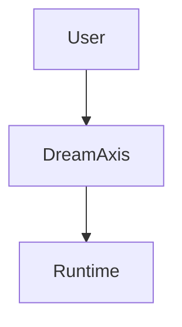

# Streaming rich probe

This message is still **streaming**, but the renderer should stay stable.

- markdown list item
- status badge text

| Surface | State |
| --- | --- |
| chat | streaming |
| operator | waiting |

```ts
const lane = "rich-stream";
console.log(lane);
```



Inline math still arriving: $E = mc^2
