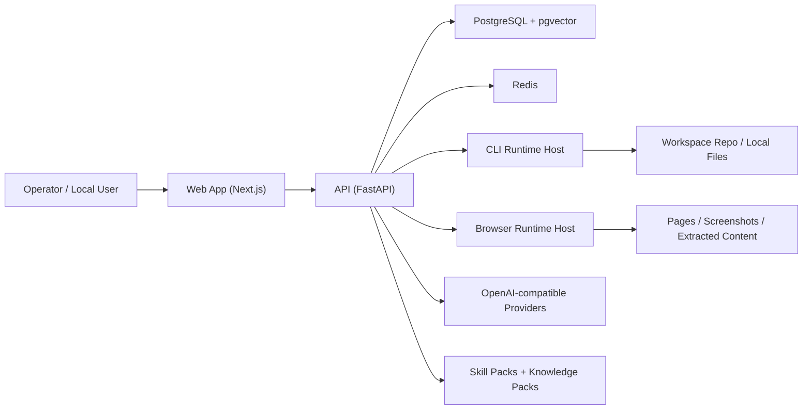

# DreamAxis Architecture

## Positioning

DreamAxis is a **local-first agent execution platform**.

The current open-source direction is:

- no-signup by default
- self-hosted provider keys
- syncable skill packs
- reusable knowledge packs
- pluggable runtime hosts

## System overview

## Main planes

The current system is organized into six working planes:

1. **Auth / App Config** - deployment mode and bootstrap behavior
2. **Providers** - user-managed OpenAI-compatible connections
3. **Knowledge** - documents, packs, indexing, retrieval
4. **Skills** - pack-backed prompt/CLI/browser skills
5. **Runtime** - CLI + Browser execution hosts, sessions, artifacts
6. **Agent Roles** - role registry for future orchestration

## Repository layout

- `apps/web` - Next.js control-center UI
- `apps/api` - FastAPI API, migrations, sync services
- `apps/worker` - CLI runtime host
- `apps/browser-worker` - Browser runtime host
- `packages/client` - shared TypeScript client + types
- `packages/ui` - shared UI constants

## Auth model

### `local_open`

Default mode:

- API seeds a local owner user
- API seeds a default workspace and conversation
- Web calls `POST /api/v1/auth/bootstrap`
- no public signup gate is required

### `password`

Optional mode:

- JWT login remains available
- intended for shared/team deployments

## Provider model

Execution is connection-driven rather than vendor-hardcoded.

Each `provider_connection` holds:

- provider type
- base URL
- encrypted API key
- health status
- default chat model
- default embedding model
- discovered/manual model catalog

Current provider strategy:

> "Any model" currently means any model reachable through an **OpenAI-compatible API**.

## Skill Pack model

Skill sources:

- `builtin`
- `imported`
- `workspace` (reserved)

Skill runtime shape:

- `skill_mode = prompt | cli | browser`
- `required_runtime_type`
- `tool_capabilities`
- `knowledge_scope`
- `pack_slug`
- `pack_version`

## Knowledge model

Knowledge sources:

- `user_upload`
- `builtin_pack`
- `git_repo` (reserved)
- `web_capture` (reserved)

Knowledge retrieval scope:

- workspace docs
- builtin packs
- optional skill-attached packs

## Runtime model

DreamAxis uses a shared runtime control plane:

- `runtimes`
- `runtime_sessions`
- `runtime_session_events`
- `runtime_executions`

Supported runtime types today:

- `cli`
- `browser`

### CLI Runtime

Implemented in `apps/worker`.

Responsibilities:

- register runtime host
- heartbeat
- create/reuse/close CLI sessions
- execute workspace-safe commands

### Browser Runtime

Implemented in `apps/browser-worker`.

Responsibilities:

- register runtime host
- heartbeat
- create/reuse/close browser sessions
- execute Playwright action lists
- return screenshots and extracted content

## Agent role registry

Current roles:

- `commander`
- `analyst`
- `builder`
- `operator`
- `archivist`
- `sentinel`

This is a configuration layer for now, not a full multi-agent DAG executor.

Each role stores:

- allowed skill modes
- allowed runtime types
- default skill pack slugs
- default knowledge pack slugs

## Key startup flow

1. API starts
2. database initializes
3. demo/local owner data is seeded
4. builtin skill packs sync
5. builtin knowledge packs sync
6. runtime workers register and heartbeat
7. Web app loads `app-config`
8. Web either bootstraps local auth or redirects to login
